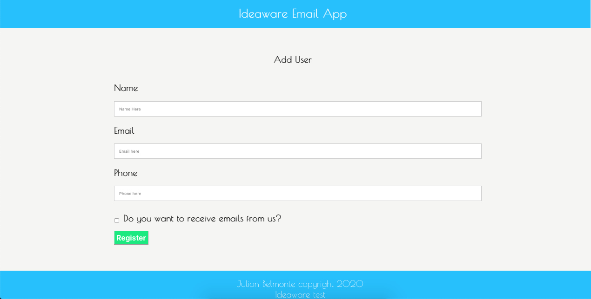

<h1 align="center">Email Subscriber App</h1>

  

## Author

:man: Julian Belmonte

- Github: [Julian Belmonte](https://github.com/jucora)
- Twitter: [@Julian Belmonte](https://www.twitter.com/JulianBelmonte)
- Linkedin: [Julian Belmonte](https://www.linkedin.com/in/julianbel)

## :pencil: Main Description

This test consists of developing an API with Ruby on Rails to send registration information to emails using Mailchimp as the Email Service Provider.

The use of Dockerfile / Docker-compose was implemented to be able to run it locally.

This application connects to an API developed in Ruby on Rails, which can be found at the following link:[Email Subscriber API](https://github.com/jucora/email-api)

## How to install the App

1. Please clone the repository by running the next comand in your machine:

<pre><code>git clone https://github.com/jucora/email-app.git</code></pre>

2. Get into the folder of the project by running the next command:

<pre><code>cd email-app</code></pre>

3. Next, run the next command to install all project dependencies:

   For Yarn: <pre><code>yarn install</code></pre>
   For npm: <pre><code>npm install</code></pre>

4. Start your local server by running the next command:

   For Yarn: <pre><code>yarn start -p 3001</code></pre>
   For npm: <pre><code>npm start -p 3001</code></pre>

Note: you can select another port if you wish. Just keep in mind that it has to be a different port from the API port.

## How to create a Docker image to be run locally

1. Make sure you are located in the root of the project and run the next command to generate the Docker images needed:

<pre><code>docker-compose up -d</code></pre>

2. You should see a similar output like the next one:

<pre><code>Creating rails-docker_database_1 ... done</code></pre>
<pre><code>Creating rails-docker_redis_1    ... done</code></pre>
<pre><code>Creating rails-docker_app_1      ... done</code></pre>
<pre><code>Creating rails-docker_sidekiq_1  ... done</code></pre>

3. You can also check the current processes by running the next command:

<pre><code>docker-compose logs</code></pre>

4. You can run the next command to make sure all containers are running:

<pre><code>docker-compose ps</code></pre>

5. You should see a similar output like the next one:

## Name Command State Ports

rails-docker_app_1 ./entrypoints/docker-resta ... Up 0.0.0.0:3000->3000/tcp
rails-docker_database_1 docker-entrypoint.sh postgres Up 5432/tcp  
rails-docker_redis_1 docker-entrypoint.sh redis ... Up 6379/tcp  
rails-docker_sidekiq_1 ./entrypoints/sidekiq-entr ... Up

Note: make sure that each container states is UP.

6. Run the next in your browser, and you are good to go:

<pre><code>localhost:3000</code></pre>

## :computer: Library, Languages and technologies

- React
- React-DOM
- JSX
- SCSS
- Node.js
- npm
- Javascript

## Report Issues

Please feel free to make a contribution, report any issue, feature request or provide any feedback. Click [here](https://github.com/jucora/email-app/issues)

## Support

Feel free to drop a like, that would support me a lot.
